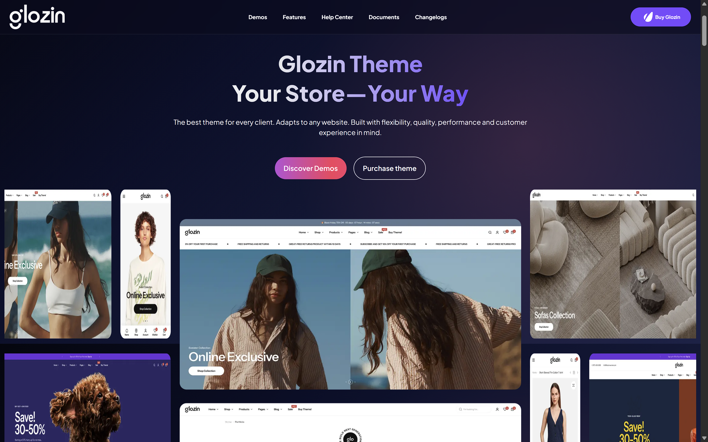

# Glozin Theme Clone — Luxury E-Commerce Landing Page

A pixel-perfect, fully responsive e-commerce landing page clone inspired by the premium Glozin Shopify Theme, built with semantic HTML5, modern CSS3, and Bootstrap 5 featuring high-end product grids, promotional hero banners, interactive sliders, and tailored responsive styling.

[](https://syedabsar99.github.io/glozin-theme-clone/)
[](https://getbootstrap.com)
[](style.css)
[](LICENSE)

---

## Preview



> **Live Demo:** [syedabsar99.github.io/glozin-theme-clone](https://syedabsar99.github.io/glozin-theme-clone/)

---

## Overview

Designed and coded by **Syed Noor Ul Absar**, this project is an in-depth exercise in translating commercial e-commerce design systems into clean, hand-crafted frontend code. Emulating the visual richness of Shopify's top-tier Glozin theme, it incorporates structured navigation, hero promotional sections, product category showcases, testimonial marquees, and footer site maps.

Every section emphasizes typography, whitespace balance, micro-animations, and complete responsiveness across modern screen widths.

---

## Key Features

- **Hero Slider & Promo Banners** — High-impact promotional banner carousel featuring smooth slide transitions and clear CTA buttons.
- **Curated Product Showcase Grids** — Multi-column product layouts with pricing tags, badge overlays (Sale / Hot), and hover scale transformations.
- **Structured E-Commerce Navigation** — Responsive navbar featuring brand identity, category links, search triggers, and shopping bag indicators.
- **Brand Trust & Feature Badges** — Highlights shipping policies, secure payment guarantees, and customer support points.
- **Mobile-First Responsive Layout** — Optimized with custom media queries and Bootstrap 5 grid utilities to eliminate horizontal scrolling on viewports under 576px.

---

## Tech Stack

| Layer | Technologies | Details |
| :--- | :--- | :--- |
| **Structure** | Semantic HTML5 | Structured layout containers, semantic sections, accessible links |
| **Styling** | Modern CSS3 & Bootstrap 5 | Custom CSS variables, responsive grid, flex utilities, hover overlays |
| **Icons & Fonts** | Google Fonts & Remix Icon | Premium serif/sans typography and vector iconography |
| **Hosting** | GitHub Pages | CDN delivery with global HTTPS |

---

## Project Structure

```text
glozin-theme-clone/
├── index.html         # Complete single-page landing page layout
├── LICENSE            # MIT open-source license
├── preview.png        # High-resolution full-page showcase screenshot
├── README.md          # Comprehensive repository documentation
└── style.css          # Design system, custom utility classes, and mobile queries
```

---

## Getting Started

No build tools or bundlers are required.

### 1. Clone the repository
```bash
git clone https://github.com/syedabsar99/glozin-theme-clone.git
```

### 2. Open locally
Launch `index.html` in your browser:
```bash
cd glozin-theme-clone
start index.html
```

Or run via any static web server:
```bash
npx serve .
# or
python -m http.server 8080
```

---

## Author & Contact

**Syed Noor Ul Absar**
- **Role**: Frontend Web Developer
- **Education**: Bachelor of Computer Applications (BCA), Chandigarh University (8.35 SGPA)
- **Portfolio**: [syedabsar99.github.io/portfolio](https://syedabsar99.github.io/portfolio/)
- **GitHub**: [@syedabsar99](https://github.com/syedabsar99)
- **LinkedIn**: [linkedin.com/in/syed-noor-ul-absar-7b6408365](https://www.linkedin.com/in/syed-noor-ul-absar-7b6408365/)
- **Email**: syedabsar99@gmail.com

---

## License

This project is licensed under the [MIT License](LICENSE) — feel free to use, modify, and distribute for educational or personal use.
